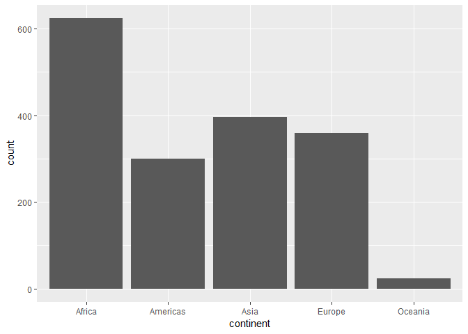

hw02-gapminder
================

``` r
library(gapminder)
library(tidyverse)
```

    ## -- Attaching packages ------------------ tidyverse 1.2.1 --

    ## v ggplot2 3.0.0     v purrr   0.2.5
    ## v tibble  1.4.2     v dplyr   0.7.6
    ## v tidyr   0.8.1     v stringr 1.3.1
    ## v readr   1.1.1     v forcats 0.3.0

    ## -- Conflicts --------------------- tidyverse_conflicts() --
    ## x dplyr::filter() masks stats::filter()
    ## x dplyr::lag()    masks stats::lag()

What is Gapminder, anyway?
--------------------------

``` r
class(gapminder)
```

    ## [1] "tbl_df"     "tbl"        "data.frame"

Gapminder is a data frame, so it should have numerous variables arranged in unique columns that each have the same number of rows.

``` r
summary(gapminder)
```

    ##         country        continent        year         lifeExp     
    ##  Afghanistan:  12   Africa  :624   Min.   :1952   Min.   :23.60  
    ##  Albania    :  12   Americas:300   1st Qu.:1966   1st Qu.:48.20  
    ##  Algeria    :  12   Asia    :396   Median :1980   Median :60.71  
    ##  Angola     :  12   Europe  :360   Mean   :1980   Mean   :59.47  
    ##  Argentina  :  12   Oceania : 24   3rd Qu.:1993   3rd Qu.:70.85  
    ##  Australia  :  12                  Max.   :2007   Max.   :82.60  
    ##  (Other)    :1632                                                
    ##       pop              gdpPercap       
    ##  Min.   :6.001e+04   Min.   :   241.2  
    ##  1st Qu.:2.794e+06   1st Qu.:  1202.1  
    ##  Median :7.024e+06   Median :  3531.8  
    ##  Mean   :2.960e+07   Mean   :  7215.3  
    ##  3rd Qu.:1.959e+07   3rd Qu.:  9325.5  
    ##  Max.   :1.319e+09   Max.   :113523.1  
    ## 

``` r
nrow(gapminder)
```

    ## [1] 1704

The **6** columns in the Gapminder data frame are

-   Country (country)
-   Continent (continent)
-   Year (year)
-   Life Expectancy (lifeExp)
-   Population (pop)
-   GDP per Capita (gdpPercap)

There are **1704** observations for each variable, and so 1704 rows.Each variable is a list of either categorical (country, continent) or quantitative (pop, lifeExp) values.

Exploring Gapminder
-------------------

#### Categorical

Looking at the Continent column, we can see there are only a few unique values this variable can take:

``` r
cont <- select(gapminder, continent)
unique(cont)
```

    ## # A tibble: 5 x 1
    ##   continent
    ##   <fct>    
    ## 1 Asia     
    ## 2 Europe   
    ## 3 Africa   
    ## 4 Americas 
    ## 5 Oceania

The histogram below provides a summary of the distribution of values throughout the "continent" column.

``` r
ggplot(gapminder, aes(continent)) +
  stat_count()
```



#### Quantitative

GDP per Capita is fairly different from the Continent variable, as it can assume any number within a certain range. In the table below we can see the minimum value of GDP per capita is $241.20, the maximum is $113,523.10

``` r
select(gapminder, gdpPercap) %>% 
  summary()
```

    ##    gdpPercap       
    ##  Min.   :   241.2  
    ##  1st Qu.:  1202.1  
    ##  Median :  3531.8  
    ##  Mean   :  7215.3  
    ##  3rd Qu.:  9325.5  
    ##  Max.   :113523.1
